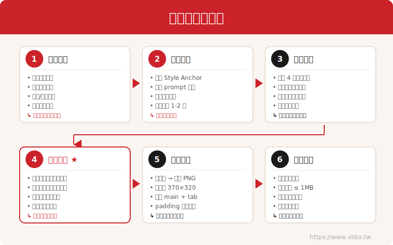

# LINE 貼圖製作器 — Claude Code Skill

> 用 AI 設計 LINE 貼圖的完整流程，從概念到上架。

[English](README.md) | **繁體中文** | [日本語](README.ja.md)

<p align="center">
  
</p>

## 這是什麼？

這是一個 **[Claude Code](https://claude.ai/claude-code) Skill** —— 一組結構化的指引與腳本，引導 Claude 完成 LINE 貼圖製作的完整流程：

1. **主題規劃** — 角色概念、表情清單、貼圖組成
2. **角色設計** — 建立 Style Anchor（風格錨點）確保視覺一致性
3. **批次生成** — AI 圖像生成搭配品質管控
4. **品質審查** — 系統化清單，攔截 AI 生圖常見問題
5. **後製處理** — 自動去背、縮放、格式轉換
6. **最終驗證** — 格式合規、可直接送審上架

## 為什麼需要 Skill？

AI 圖像生成很強大，但也很不穩定。沒有防護機制的話，你會反覆遇到這些問題：

| 問題 | 發生頻率 | 影響 |
|------|----------|------|
| 一張圖冒出兩個角色 | 非常頻繁 | 必須重新生成 |
| 16 張字體全不同 | 幾乎必然 | 看起來不專業 |
| 角色沒有居中 | 經常 | 在聊天室裡裁切效果差 |
| 出現錯誤的文化/政治符號 | 偶爾 | 有爭議風險 |
| 角色大小不一致 | 經常 | 整組看起來不協調 |

這個 Skill 把**踩坑經驗**轉化成可重複使用的防護指令，讓你不必每次都重新學一遍。

## 快速開始

### 1. 安裝 Skill

將 Skill 複製到 Claude Code 的 skills 目錄：

```bash
# 建立目錄
mkdir -p ~/.claude/skills/line-sticker-maker

# 複製檔案
cp SKILL.md ~/.claude/skills/line-sticker-maker/
cp -r scripts/ ~/.claude/skills/line-sticker-maker/scripts/
```

### 2. 安裝依賴

後製腳本需要 Pillow：

```bash
pip install Pillow
```

### 3. 開始使用

在 Claude Code 裡直接說：

```
幫我設計一組 16 張的 LINE 貼圖，主題是 [你的主題]
```

Claude 會自動啟用 Skill，引導你走完完整流程。

## 專案結構

```
line-sticker-maker-skill/
├── SKILL.md                          # 主要 Skill 檔（Claude Code 讀取此檔）
├── scripts/
│   └── process_stickers.py           # 後製腳本：去背、縮放、格式轉換
├── docs/
│   └── pipeline-overview.svg         # 流程圖
├── examples/
│   └── sample-planning-table.md      # 貼圖規劃表範例
├── LICENSE
└── README.md
```

## 後製腳本

`scripts/process_stickers.py` 將 AI 生成的原始圖片轉換為 LINE 規格：

```bash
# 基本用法
python3 scripts/process_stickers.py \
  --input-dir ./my-stickers \
  --output-dir ./line_format

# 逐張調整 padding
python3 scripts/process_stickers.py \
  --input-dir ./my-stickers \
  --output-dir ./line_format \
  --padding-override "04:55,08:45"
```

### 功能：

- **去白底** → 透明 PNG
- **縮放至 370×320px**，角色居中，保留安全邊距
- **生成 main.png**（240×240）與 **tab.png**（96×74）
- **驗證** 所有檔案大小不超過 1MB

### 參數說明：

| 參數 | 預設值 | 說明 |
|------|--------|------|
| `--input-dir` | （必填） | 包含 `sticker_*.png` 的目錄 |
| `--output-dir` | （必填） | 輸出 LINE 格式檔案的目錄 |
| `--default-padding` | `10` | 預設內距（像素） |
| `--bg-threshold` | `240` | 白底偵測門檻值（0-255） |
| `--padding-override` | `""` | 逐張調整，如 `"04:55,08:45"` |
| `--main-source` | `1` | 用哪張貼圖生成 main/tab 圖 |

## 核心概念：Style Anchor（風格錨點）

**Style Anchor** 是一段固定的 prompt 前綴，所有貼圖共用，以維持視覺一致性：

```
[藝術風格] + [角色描述] + [服裝細節] + [文化標記] + [構圖規則] + [技術規格]
```

範例：
```
Cute chibi kawaii style LINE sticker, exactly ONE single character
centered in the image, a round-faced boy with big expressive eyes
and rosy cheeks, thick black outline, cartoon style, high contrast
colors, simple clean white background, flat illustration, no shadow
```

每張貼圖只需要改變表情、動作和文字，其他全部維持不變。

## LINE Creators Market 規格

| 素材 | 尺寸 (px) | 格式 | 數量 |
|------|-----------|------|------|
| 主圖 | 240 × 240 | PNG，透明背景 | 1 |
| 貼圖本體 | 370 × 320 | PNG，透明背景 | 8 / 16 / 24 / 32 / 40 |
| 聊天頁籤圖示 | 96 × 74 | PNG，透明背景 | 1 |

- 所有圖片：RGBA PNG、RGB 色彩模式
- 單檔上限：1MB
- 內容距邊緣至少 10px

## 貢獻

發現新的 AI 生圖陷阱？有更好的 prompt 策略？歡迎 PR！

特別歡迎這些方向的貢獻：
- **動態貼圖支援**（APNG 格式）
- **文字疊加腳本**（`scripts/add_text.py`）程式化加字
- **更多 Style Anchor 模板**，適用於不同角色類型
- **其他 AI 模型的 prompt 策略**

## 授權

MIT License — 詳見 [LICENSE](LICENSE)。

## 作者

由 [Vista](https://www.vista.tw) 製作 — 從實際 AI 貼圖設計經驗中提煉而成。
